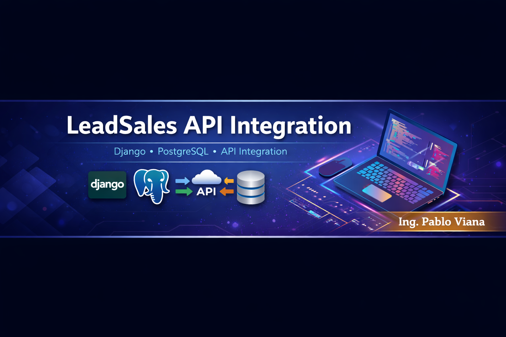

<p align="center">
  
</p>

<h1 align="center">🚀 LeadSales API Integration</h1>

<p align="center">
  Django backend for integrating, organizing, and exporting LeadSales CRM data
</p>

<p align="center">
  
  
  
  
</p>

---

# 🚀 LeadSales API Integration with Django

A Django-based backend application built to solve a real limitation in **LeadSales CRM**:  
the lack of flexible organization and export of leads outside their platform.

This project integrates directly with the LeadSales API, persists data locally, and exposes it in a structured, performant, and extensible way.

Built as a **solo developer** for a **real client** and delivered for production use.

---

## 🧠 The Problem

LeadSales provides valuable CRM functionality, but:
- Leads are difficult to organize outside the platform
- Export options are limited
- External reporting requires direct API consumption

For a business, this means friction, manual work, and lost time.

This project solves that by creating a custom backend layer with full control over lead data.

---

## ✨ Features

- 🔗 Direct integration with the LeadSales API
- 📊 Fetches and structures:
  - Funnels
  - Stages
  - Leads per stage
- 🧱 Persists external data into Django models
- 🔐 Secure configuration using environment variables
- ⚡ Optimized HTTP requests for faster responses
- 🧩 Extensible architecture ready for reporting and exports

---

## 🧱 Tech Stack

- Django  
- PostgreSQL  
- HTML  
- CSS  
- Railway  

Simple, maintainable, and production-oriented architecture.

---

## 🚀 Getting Started

### 1. Clone the repository

```bash
git clone https://github.com/PabloViana12580/leadsales-api-integration.git
cd leadsales-api-integration

<p align="center">
  
</p>

<h1 align="center">🚀 LeadSales API Integration</h1>

<p align="center">
  Django backend for integrating, organizing, and exporting LeadSales CRM data
</p>

<p align="center">
  
  
  
  
</p>

---

# 🚀 LeadSales API Integration with Django

A Django-based backend application built to solve a real limitation in **LeadSales CRM**:  
the lack of flexible organization and export of leads outside their platform.

This project integrates directly with the LeadSales API, persists data locally, and exposes it in a structured, performant, and extensible way.

Built as a **solo developer** for a **real client** and delivered for production use.

---

## 🧠 The Problem

LeadSales provides valuable CRM functionality, but:
- Leads are difficult to organize outside the platform
- Export options are limited
- External reporting requires direct API consumption

For a business, this means friction, manual work, and lost time.

This project solves that by creating a custom backend layer with full control over lead data.

---

## ✨ Features

- 🔗 Direct integration with the LeadSales API
- 📊 Fetches and structures:
  - Funnels
  - Stages
  - Leads per stage
- 🧱 Persists external data into Django models
- 🔐 Secure configuration using environment variables
- ⚡ Optimized HTTP requests for faster responses
- 🧩 Extensible architecture ready for reporting and exports

---

## 🧱 Tech Stack

- Django  
- PostgreSQL  
- HTML  
- CSS  
- Railway  

Simple, maintainable, and production-oriented architecture.

---

## 🚀 Getting Started

### 1. Clone the repository

```bash
git clone https://github.com/PabloViana12580/leadsales-api-integration.git
cd leadsales-api-integration
```
### 2. Set up a virtual environment
```bash
python3 -m venv venv
source venv/bin/activate
pip install -r requirements.txt
```

### 3. Create a .env file

Create a .env file in the project root:

## 🔐 Environment Variables Reference

| Key                 | Description                          |
| ------------------- | ------------------------------------ |
| `SECRET_KEY`        | Django secret key                    |
| `DB_NAME`           | PostgreSQL database name             |
| `DB_USER`           | PostgreSQL user                      |
| `DB_PASSWORD`       | PostgreSQL password                  |
| `DB_HOST`           | PostgreSQL host (default: localhost) |
| `DB_PORT`           | PostgreSQL port (e.g. 5433)          |
| `LEADSALES_API_KEY` | API token for LeadSales              |
| `DEBUG`             | Django debug mode (True/False)       |

## 🐘 PostgreSQL Setup (Linux)

### 4. Install PostgreSQL
```bash
sudo apt update
sudo apt install postgresql postgresql-contrib
```

### 5. Verify installation
```bash
which psql
```

### 6. Start PostgreSQL (example: version 17)
```bash
sudo systemctl start postgresql@17-main
```

### 7. Check PostgreSQL status
```bash
sudo systemctl status postgresql@17-main
```

### 8. Open PostgreSQL shell
```bash
sudo -u postgres psql -p 5433
```
Use pg_lsclusters to confirm the correct port.

### 9. Create database and user
```bash
CREATE DATABASE leadsales_db;
CREATE USER leadsales_user WITH PASSWORD 'your_password';
GRANT ALL PRIVILEGES ON DATABASE leadsales_db TO leadsales_user;
\q
```

## 🧬 Database Migrations
### 10. Run migrations
```bash
python manage.py makemigrations
python manage.py migrate
```

### ▶️ Run the Server
```bash
11. Start the development server
python manage.py runserver
```

### 📂 Project Structure
```
leadsales-api-integration/
├── app/
├── manage.py
├── requirements.txt
├── .env
└── README.md
```
## 📌 Project Status

- Delivered to client

- Actively used

- Production-ready

- Open for extension (exports, dashboards, analytics)

## 👨‍💻 Author
```
Pablo Viana
Backend Developer
Django · APIs · Data Engineering
```
If you find this project useful or interesting, a ⭐ on the repository is always appreciated.

